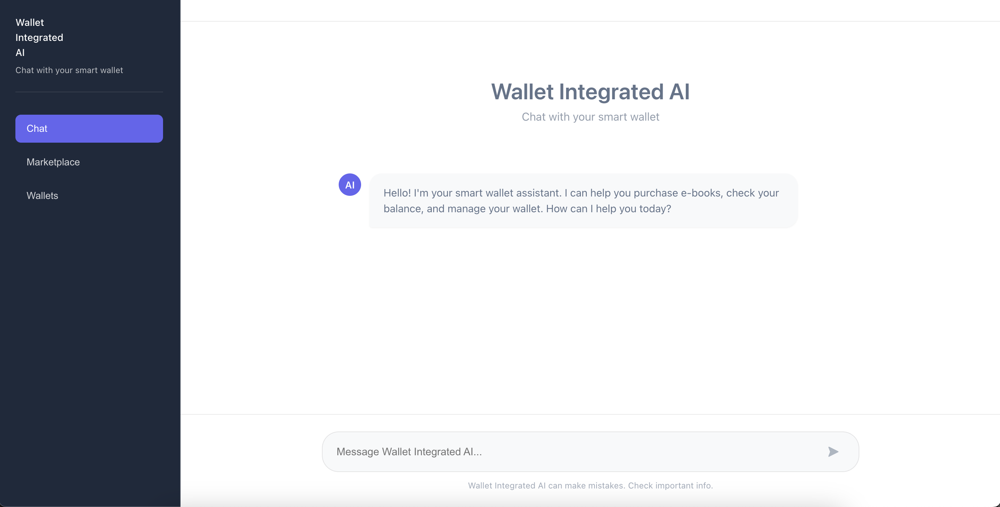
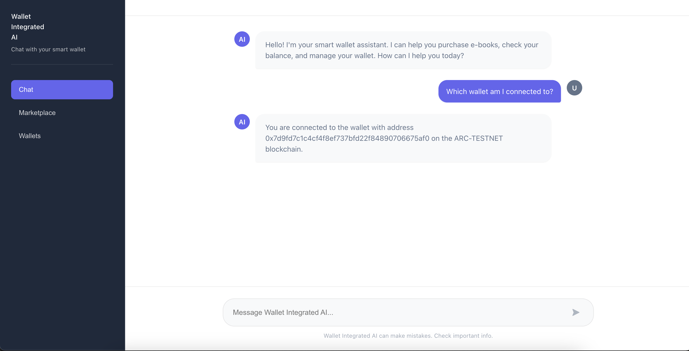
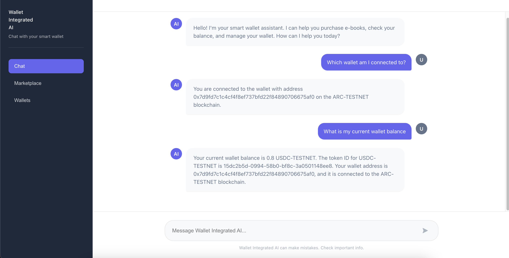
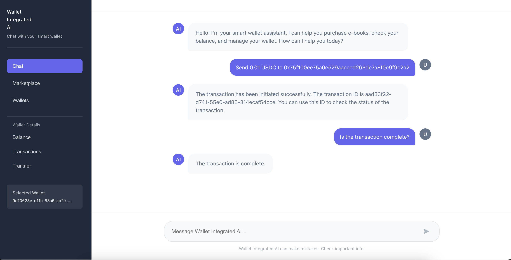
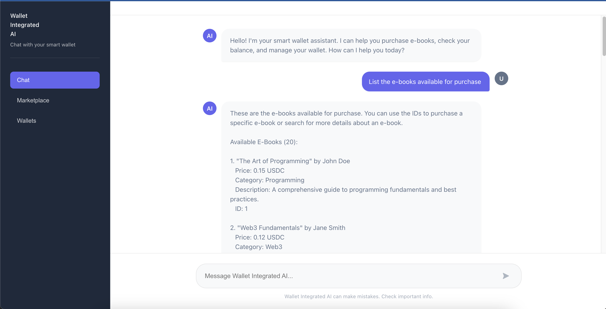
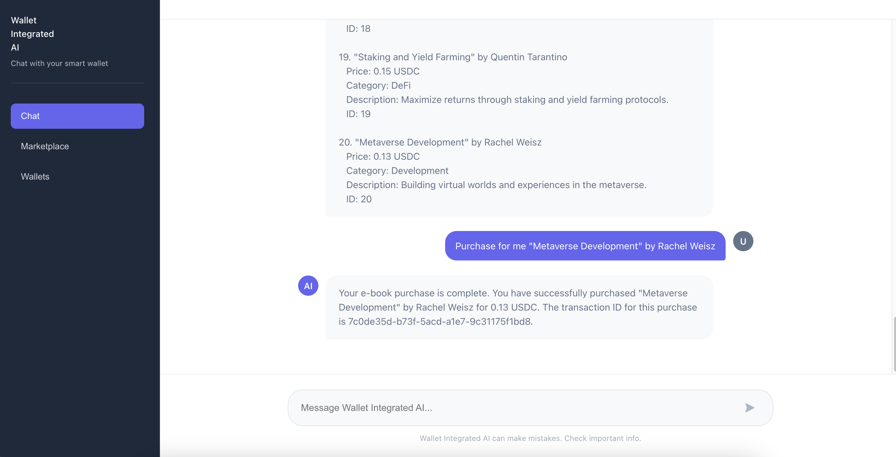
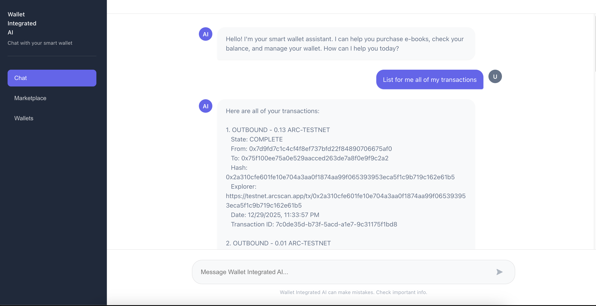
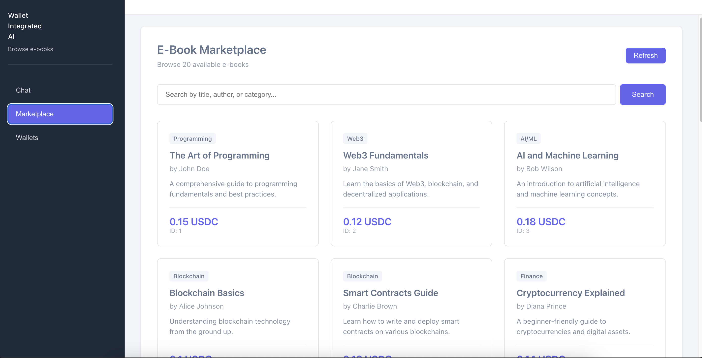

# Wallet-Integrated AI: Autonomous Smart Wallet Agent

An AI-powered autonomous wallet system that uses USDC on ARC Testnet to perform transactions on your behalf. This project demonstrates how to build a smart wallet agent that can autonomously purchase items from a marketplace, check balances, transfer tokens, and manage transactions through natural language conversations.

## Overview

This project combines:
- **Circle Developer-Controlled Wallets** for blockchain wallet management
- **Groq AI (Llama 3.3)** for natural language processing and decision-making
- **LangChain.js** for AI agent orchestration
- **React + TypeScript** for the frontend interface
- **Node.js + Express** for the backend API

The AI agent can:
- ✅ Check wallet balances and transaction history
- ✅ Transfer USDC tokens to any address
- ✅ Browse and purchase e-books from a marketplace
- ✅ Answer questions about wallet status and transactions
- ✅ Execute transactions autonomously based on user requests

## Quick Start

### Prerequisites

- Node.js 18+ and npm
- Circle Developer Account ([Sign up here](https://console.circle.com/))
- Groq API Key ([Get one here](https://console.groq.com/))

### Installation

1. **Clone the repository:**
   ```bash
   git clone https://github.com/Stephen-Kimoi/wallet-intergrated-ai
   cd wallet-intergrated-ai
   ```

2. **Install dependencies:**
   ```bash
   npm install
   npm run install:all
   ```

## 📋 Setup Guide

### Step 1: Circle API Configuration

1. **Sign up for Circle API Key:**
   - Visit [Circle Console](https://console.circle.com/)
   - Create an account and get your `CIRCLE_API_KEY`

2. **Generate Entity Secret:**
   ```bash
   cd backend
   npm run generate:entity-secret
   ```
   This will output a 32-byte hex string. **Copy this value** - you'll need it in the next step.

3. **Register Entity Secret with Circle:**
   ```bash
   npm run register:entity-secret
   ```
   This encrypts and registers your Entity Secret with Circle. Save the recovery file securely!

### Step 2: Wallet Setup

1. **Create a Wallet Set:**
   ```bash
   npm run create:wallet-set
   ```
   Or with a custom name:
   ```bash
   npm run create:wallet-set "My Custom Wallet Set Name"
   ```
   **Save the Wallet Set ID** from the output.

2. **Create Wallets:**
   ```bash
   npm run create:wallets <wallet-set-id>
   ```
   This creates 2 wallets by default:
   - **Wallet 1**: Your primary wallet (for purchases and transactions)
   - **Wallet 2**: Marketplace wallet (receives payments from purchases)

   **Save both wallet IDs and addresses** from the output.

3. **Fund Your Wallets:**
   - Visit [Circle Faucet](https://faucet.circle.com/)
   - Select **ARC Testnet**
   - Enter your primary wallet address
   - Request testnet USDC

### Step 3: Environment Configuration

1. **Backend Configuration:**
   ```bash
   cd backend
   cp .env.example .env
   ```
   
   Edit `backend/.env` and add:
   ```env
   CIRCLE_API_KEY=your_circle_api_key_here
   CIRCLE_ENTITY_SECRET=your_32_byte_hex_entity_secret_here
   GROQ_API_KEY=your_groq_api_key_here
   PRIMARY_WALLET_ID=your_primary_wallet_id_here
   MARKETPLACE_WALLET_ADDRESS=your_marketplace_wallet_address_here
   ```

2. **Generate API Secret:**
   ```bash
   node -e "console.log(require('crypto').randomBytes(32).toString('hex'))"
   ```
   Add the output to both `.env` files:
   ```env
   # backend/.env
   API_KEY_SECRET=generated_api_secret_here
   
   # frontend/.env
   VITE_API_KEY=generated_api_secret_here
   ```

3. **Frontend Configuration:**
   ```bash
   cd frontend
   cp .env.example .env
   ```
   
   Edit `frontend/.env`:
   ```env
   VITE_API_KEY=generated_api_secret_here
   VITE_API_BASE_URL=/api
   VITE_PRIMARY_WALLET_ID=your_primary_wallet_id_here
   ```

### Step 4: Start the Application

Run both frontend and backend simultaneously:
```bash
npm run dev
```

Or run them separately:
```bash
# Terminal 1 - Backend
npm run dev:backend

# Terminal 2 - Frontend
npm run dev:frontend
```

The application will be available at:
- **Frontend**: http://localhost:3000
- **Backend API**: http://localhost:3001

## 💬 Using the AI Wallet Agent

### Chat Interface

The main interface includes a chat where you can interact with your wallet using natural language.



### Example Queries

1. **Check Wallet Information:**
   - "Which wallet am I connected to?"
   - "What is my current wallet balance?"
   
   

2. **View Balance:**
   - "What is my current wallet balance?"
   
   

3. **Transfer Tokens:**
   - "Send 0.01 USDC to 0x75f100ee75a0e529aacced263de7a8f0e9f9c2a2"
   
   

4. **Browse Marketplace:**
   - "List the e-books available for purchase"
   
   

5. **Purchase E-books:**
   - "Purchase for me 'Metaverse Development' by Rachel Weisz"
   - "Buy 'Crypto Trading Strategies' by Penelope Cruz"
   
   

6. **View Transactions:**
   - "List for me all transactions"
   - "Show my transaction history"
   
   

### Marketplace

Navigate to the **Marketplace** tab to browse available e-books. The marketplace displays:
- E-book titles, authors, and descriptions
- Prices in USDC
- Purchase status (shows "✓ Purchased" for owned items)



## 🏗️ Project Structure

```
wallet-intergrated-ai/
├── backend/
│   ├── src/
│   │   ├── agent/              # AI agent (Groq + LangChain)
│   │   ├── marketplace/        # E-book marketplace logic
│   │   ├── routes/             # API routes
│   │   ├── wallet/             # Circle SDK wrapper
│   │   └── scripts/            # Setup scripts
│   └── .env.example
├── frontend/
│   ├── src/
│   │   ├── components/         # React components
│   │   └── services/           # API service
│   └── .env.example
├── documentation/               # Detailed guides
└── package.json
```

## 🔧 Available Scripts

### Root Level
- `npm run dev` - Start both frontend and backend
- `npm run dev:backend` - Start backend only
- `npm run dev:frontend` - Start frontend only
- `npm run build` - Build both projects
- `npm run install:all` - Install all dependencies

### Backend Scripts
- `npm run generate:entity-secret` - Generate Entity Secret
- `npm run register:entity-secret` - Register Entity Secret with Circle
- `npm run create:wallet-set` - Create a new wallet set
- `npm run create:wallets <wallet-set-id>` - Create wallets

## 📚 Documentation

For detailed guides, see the `documentation/` folder:

- **[Entity Secret Setup](./documentation/01_ENTITY_SECRET_SETUP.md)** - Complete guide for Entity Secret generation and registration
- **[Wallet Setup](./documentation/02_WALLET_SETUP.md)** - Wallet creation on ARC Testnet
- **[API Security](./documentation/03_API_SECURITY.md)** - API key authentication setup
- **[Transaction Checking](./documentation/04_TRANSACTION_CHECKING.md)** - How to check and monitor transactions
- **[Token Transfer](./documentation/05_TOKEN_TRANSFER.md)** - Token transfer operations

## 🎓 Learning Resources

- [Circle Developer Documentation](https://developers.circle.com/)
- [Circle Console](https://console.circle.com/)
- [Groq Documentation](https://console.groq.com/docs)
- [LangChain.js Documentation](https://docs.langchain.com/oss/javascript/langchain/overview)

## 🤝 Contributing

This is a tutorial/educational project demonstrating how to build an AI-powered autonomous wallet system.

---

**Note**: This project uses ARC Testnet for testing. All transactions use testnet USDC and have no real-world value.